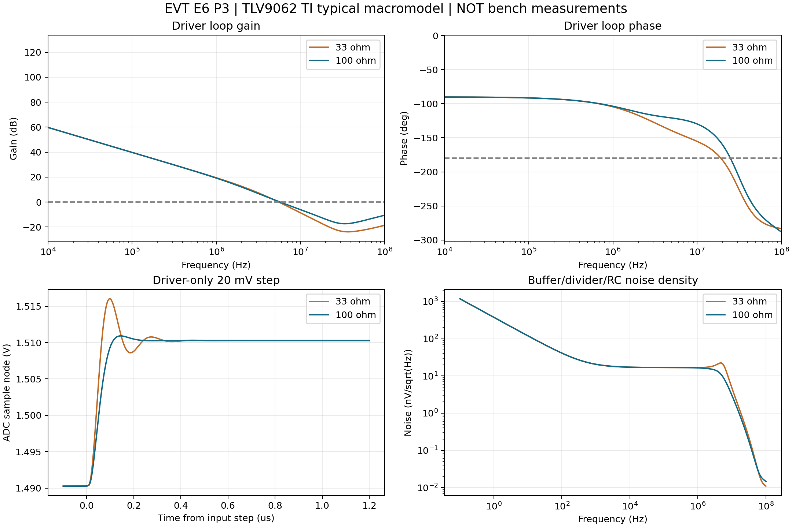

# EVT E6 P3：TLV9062 替换及模拟输入验证

2026-09-17。结论：U16/U17改为TLV9062IDGKR（C398356）；R11/R12从33Ω改为100Ω（RC0402FR-07100RL / C106232）；C29/C30保留330pF、C0G、±5%。针序、焊盘、布线、板框及光学器件坐标不变。现有3.3V电源和50帧/秒时序保留。

**已完成原厂典型宏模型仿真与静态设计验证；未完成首板实测，不代表量产放行或16位有效精度达标。** 噪声已量化，算法允许噪声尚未给定，不能标为噪声验收通过。

## 方法与适用范围

- ngspice 47，PSpice兼容模式；TI官方SBOMAG1E下载包中的TLV9062 Rev.D（2021-06-17）宏模型。原文模型不改；ngspice副本仅将R_NOISELESS的T_ABS=-273.15语义显式转换为每电阻noisy=0，电气参数不改。模型原文、兼容副本、网表、日志、波形及results.json均在analog_validation/，运行脚本为tools/simulate_tlv9062.py。模型SHA256：94f6ec5479e928f03403c107df2b67c46a780cc541a2eac5c5e5e923230e2b90。
- 两级跟随器、10k/20k分压、分压点额外5pF寄生；输出反馈取在隔离电阻之前。AD7386用数据手册图28等效：引脚3pF、开关200Ω、采样15pF。不是ADI完整ADC模型。
- 环路串联AC注入，在维持DC负反馈时计算−Vout/Vinv；1Hz至100MHz。对照33/47/68/100Ω，入选方案检查3.0/3.3/3.399V、−25/25/85°C、C=313.5/346.5pF、R=99Ω以及输出侧和ADC侧各0/30pF假设寄生。另查第一级50pF负载及输出级0.1/2.2V工作点。共51组环路分析。
- 温度扫描仅覆盖宏模型实际实现的温度效应；它不包含硅工艺统计分布或全部温漂极限。PCB寄生是灵敏度假设，未做场求解提取。TI模型高频外推不作为器件规格。

## 稳定性

| 指标 | 33Ω＋330pF | 100Ω＋330pF |
|---|---:|---:|
| 典型输出级相位裕量（含假设寄生） | 38.04° | 57.99° |
| 输出级20mV阶跃过冲 | 28.72% | 3.20% |
| 入选方案灵敏度扫描最小输出级相位裕量 | 未作为入选方案 | 55.61° |

第一级缓冲最小相位裕量54.19°。本次工程目标为输出级≥50°、第一级≥45°；33Ω没有达到输出级目标，不意味着断言它必然自激。100Ω显著改善模型中的裕量和振铃，因此本版采用100Ω。首板须检查小信号阶跃、容差、温度及探头负载下无持续振荡；探头优先低电容有源探头。

## ADC建立时间与时序

- 2.5V参考下1LSB=38.147µV，0.5LSB=19.073µV。以下建立时间是对**各工作点最终稳态值**的动态残差，不是对理想电压的绝对精度；失调、分压增益误差须另外校准。
- 两级缓冲100Ω方案：20mV小阶跃及0.15→3.1V大阶跃分别约0.46µs（小阶跃）及1.12µs（大阶跃）；所查大/小阶跃与低/高电源温度灵敏度案例最慢1.15µs，均小于5µs工程预算。线性测试避开电源轨，不能据此保证饱和恢复。
- 采样电容预充0V或2.5V后接入的简化电荷回灌压力测试，恢复至0.5LSB最慢0.36µs。110ns时仍有约2.13mV动态误差，**不批准4MSPS/最短采集窗口**。此预充是压力假设，不是声称ADC每次真实回灌幅度。
- 100Ω×330pF=33ns；单纯RC对16位半LSB约0.389µs，不能替代闭环分析。含理想100k/22p单极点TIA近似时，整个路径约25.54µs；真实PD电容、TIA噪声增益、MUX和饱和恢复不在该近似中。
- 保留MUX后100µs、亮灯后50µs等待，CS低24µs，背景到亮灯的CS高间隔126µs。新增约定：所有事务（含flush）CS高至少5µs；不启用内部高速过采样。50µs等待有模型层面余量，仍须实测LED电流稳定和真实光链路。
- 修正旧接口中10ms参考等待：在模拟电源稳定后等待至少20ms作为调试起点；原厂11ms只给到1%稳定条件，不能宣称20ms即保证16位稳定。首板用时间序列确认精密读数稳定。

## 噪声预算

ngspice .noise积分0.1Hz至100MHz，包含两级运放模型、100Ω假设源阻抗、10k/20k分压及RC热噪声；输入源无噪声。噪声分析中将ADC内部200Ω开关电阻设为无噪声，保留其阻抗/滤波效应，避免与ADC SNR预算重复计入内部热噪声。连续时间积分用于一次样本宽带噪声预算，不能只积分到50Hz帧率或其Nyquist频率而忽略混叠。

| ADC输入端指标 | 33Ω方案 | 100Ω方案 |
|---|---:|---:|
| 缓冲/分压/RC RMS | 51.83µV | 36.46µV |
| 加入ADC典型SNR等效噪声后的估计 | 71.81µV | 61.64µV |
| 暗/亮不相关时差分RMS估计 | 101.55µV | 87.18µV |

ADC部分按手册表11内部2.5V参考、无过采样的典型85dB SNR折算约49.70µV RMS，采用满量程正弦0.884V RMS并按不相关RSS合成。这是粗略预算，不是实测DC转换噪声；没有重复加量化噪声。100Ω方案差分约2.29code RMS。

**上述未包含PD散粒噪声、TIA实际噪声、MUX、实际输入源噪声、电源/参考额外干扰、PCB串扰及灯驱动干扰。不能当作整机噪声上限，也不构成ENOB或噪声验收通过。** 暗亮相减可抑制共同固定偏移，不能消除随机噪声；相关低频噪声的结果也不一定等于√2倍。

TLV9062单级25°C最大失调1.6mV，两级按2/3缩放最坏同向合计约2.667mV（约70code），未计全温和其他误差；可校准固定部分，但共模变化、漂移及非线性需实测。ADC最大1µA输入漏电通过100Ω还可引入100µV静态误差；不可把建立时间通过等同总精度通过。

## 首板复核

T10：两通路最坏阶跃，均值残差目标≤0.5LSB（校准稳态为基准），测振铃/过冲，若5µs缓冲预算或50µs光链路等待不够即延长并复测。T11：输入短接到低噪声固定电平，在暗/亮采样时序下分别采至少10000组，记录单次及差分RMS、FFT和通道相关性；系统噪声门限由算法需求确定。T28/T29/T30给出此次替代专门测试。首板未测，不将任何仿真项改为实测通过。

## 原厂及采购来源

- TI TLV9062数据手册：https://www.ti.com/lit/gpn/TLV9062
- TI官方PSpice下载包：https://www.ti.com/lit/zip/sbomag1
- AD7386 Rev.A图28、表5、表11：https://www.analog.com/media/en/technical-documentation/data-sheets/ad7386-7387-7388.pdf
- TLV9062IDGKR立创C398356：https://item.szlcsc.com/380586.html
- R11/R12复用现有100Ω料号C106232，减少一类BOM物料。最终共41类、167件/板。
